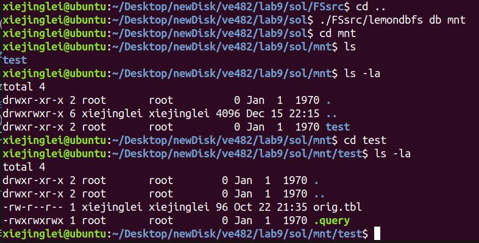
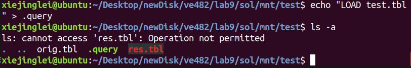

# VE482 Lab 9: FUSE
PGroup 1, FA 2019

## Objective
This lab aims to implement a FUSE filesystem to realize lemonDB queries in special ways.

## Implementation

### 1. Recover the `lemondbfs.c` file
```bash
vi -r .lemondbfs.c.swp
```
### 2. Complete functions in `lemondbfs.c`
Please view `lemondbfs.c`

### 3. Modify the main function of lemonDB and write new interface to interact with `lemondbfs.c`
Pleaae view `run_query.cpp` `run_query.h`. The modification of lemonDB main function is shown in `run_query.cpp`, while the interface for the file system is in `run_query.h`.


## Execution
### 1. Compile the source code using `make`
### 2. Mount the file system
```bash
./lemondbfs <db_dir> <mount_dir>
```
### 3. Run queries
Example:
```bash
cd testtable
echo "SELECT ( KEY c0 ) FROM testtable ;" >> .query
```
### 3. Unmount the file system
```bash
fusermount -u <mount_dir>
```

## Outcomes
Our code compiles, and can be mounted to the target directory successully.



However, we cannot access the files after running the queries. It says "permission denied". Some errors related to read might be happening.


